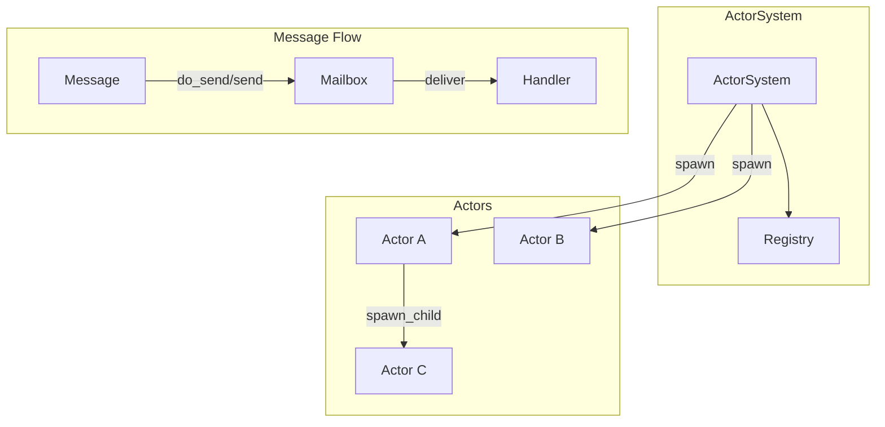
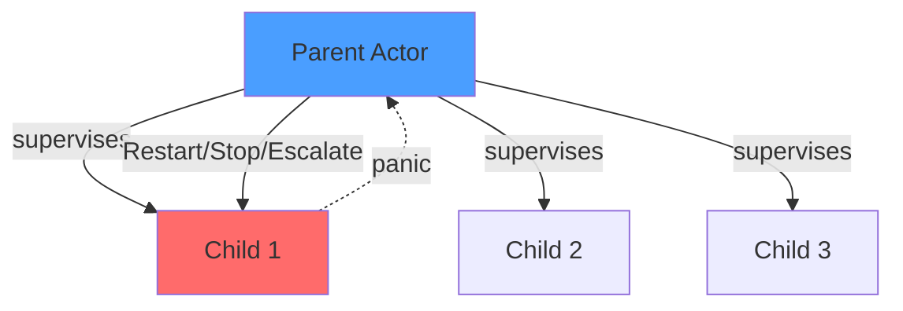
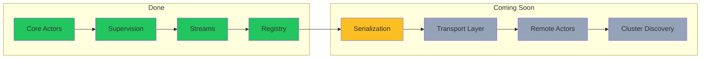
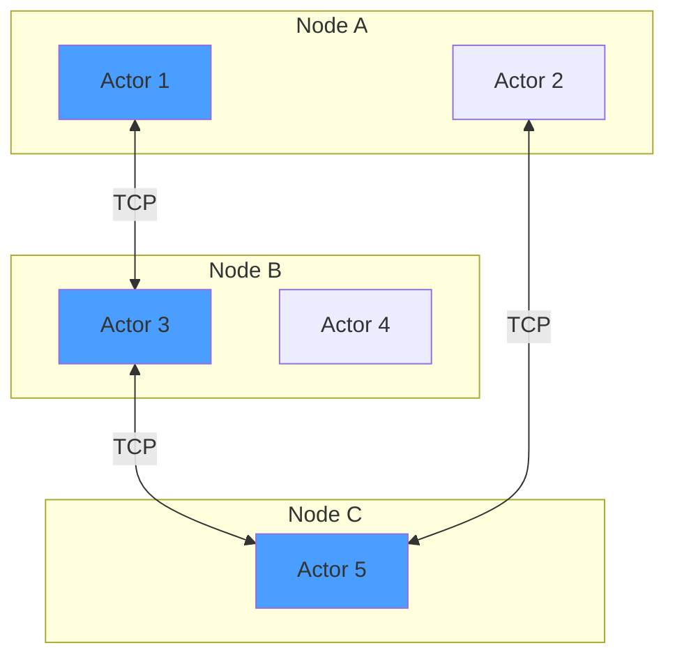

# Cinema

A lightweight actor model framework for Rust, inspired by Erlang/OTP, Akka, and actix.

## Features

- **Async/await native** - Built on Tokio
- **Typed messages** - Compile-time message safety
- **Supervision** - Restart, Stop, Escalate strategies (OTP-style)
- **Streams** - Process external data streams within actors
- **Timers** - `run_later` and `run_interval` scheduling
- **Registry** - Name-based actor lookup with auto-cleanup
- **Async handlers** - Non-blocking I/O in message handlers

## Architecture



## Supervision Tree



## Quick Start

```rust
use cinema::{Actor, Handler, Message, ActorSystem, Context};

// Define a message
struct Greet(String);

impl Message for Greet {
    type Result = String;
}

// Define an actor
struct Greeter;

impl Actor for Greeter {}

impl Handler<Greet> for Greeter {
    fn handle(&mut self, msg: Greet, _ctx: &mut Context<Self>) -> String {
        format!("Hello, {}!", msg.0)
    }
}

#[tokio::main]
async fn main() {
    let system = ActorSystem::new();
    let addr = system.spawn(Greeter);

    // Fire and forget
    addr.do_send(Greet("World".into()));

    // Request-response
    let response = addr.send(Greet("Cinema".into())).await.unwrap();
    println!("{}", response); // "Hello, Cinema!"
}
```

## Supervision

```rust
use cinema::{Actor, Context, SupervisorStrategy};

struct Parent;
struct Child;

impl Actor for Parent {
    fn started(&mut self, ctx: &mut Context<Self>) {
        // Restart child up to 3 times if it panics
        ctx.spawn_child_with_strategy(
            || Child,
            SupervisorStrategy::Restart { max_retries: 3 },
        );
    }
}

impl Actor for Child {}
```

**Strategies:**
- `Stop` - Let actor die (default)
- `Restart { max_retries }` - Restart on panic, up to N times
- `Escalate` - Propagate failure to parent (OTP-style)

## Streams

```rust
use cinema::{Actor, StreamHandler, Context};
use tokio_stream::wrappers::UnboundedReceiverStream;

struct MyActor {
    stream: Option<UnboundedReceiverStream<i32>>,
}

impl Actor for MyActor {
    fn started(&mut self, ctx: &mut Context<Self>) {
        if let Some(stream) = self.stream.take() {
            ctx.add_stream(stream);
        }
    }
}

impl StreamHandler<i32> for MyActor {
    fn handle(&mut self, item: i32, _ctx: &mut Context<Self>) {
        println!("Received: {}", item);
    }

    fn finished(&mut self, _ctx: &mut Context<Self>) {
        println!("Stream completed");
    }
}
```

## Registry

```rust
let system = ActorSystem::new();
let addr = system.spawn(MyActor);

// Register with auto-unregister on actor death
system.register("my_actor", addr);

// Lookup
if let Some(addr) = system.lookup::<MyActor>("my_actor") {
    addr.do_send(SomeMessage);
}
```

## Examples

Run the TCP chat server example:

```bash
cargo run -p chat
```

Connect with netcat:

```bash
nc localhost 8080
```

## Roadmap



### Distributed Actors (Coming Soon)

Cinema is being built with distribution in mind. Upcoming features:

- **Remote Actors** - Send messages to actors on other nodes with the same API
- **Location Transparency** - `Addr<A>` works whether the actor is local or remote
- **Cluster Membership** - Automatic node discovery and failure detection
- **Distributed Registry** - Lookup actors across the cluster



## License

MIT
