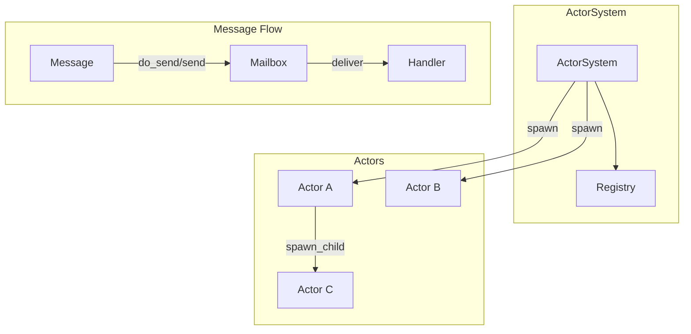
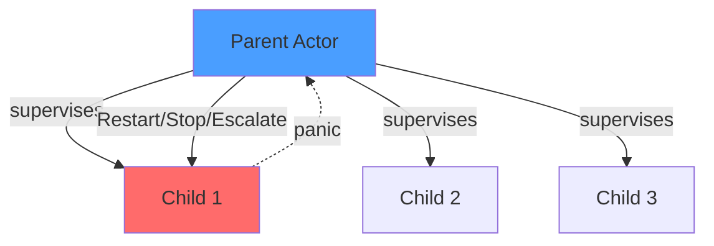
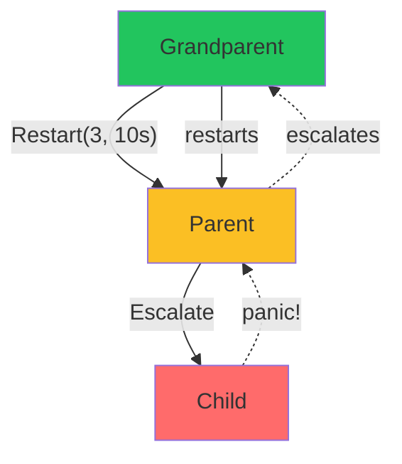
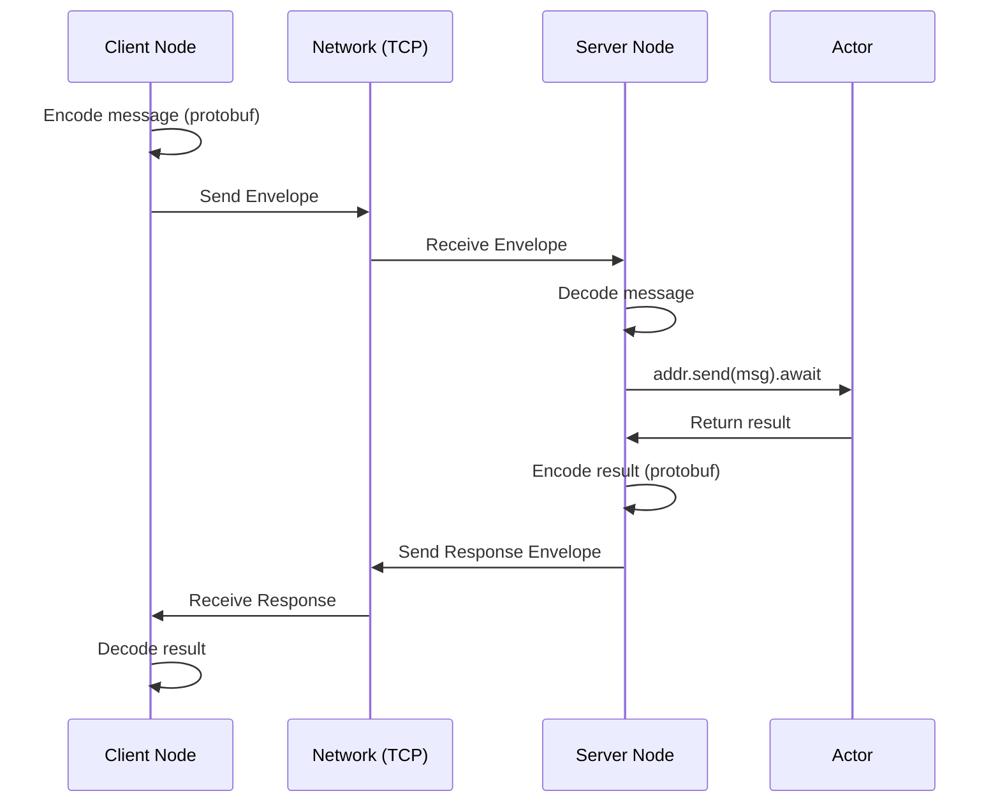
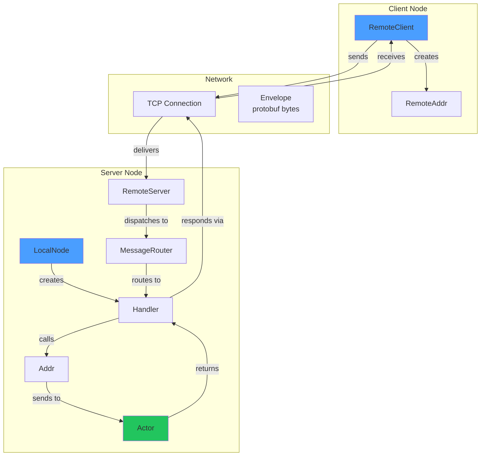
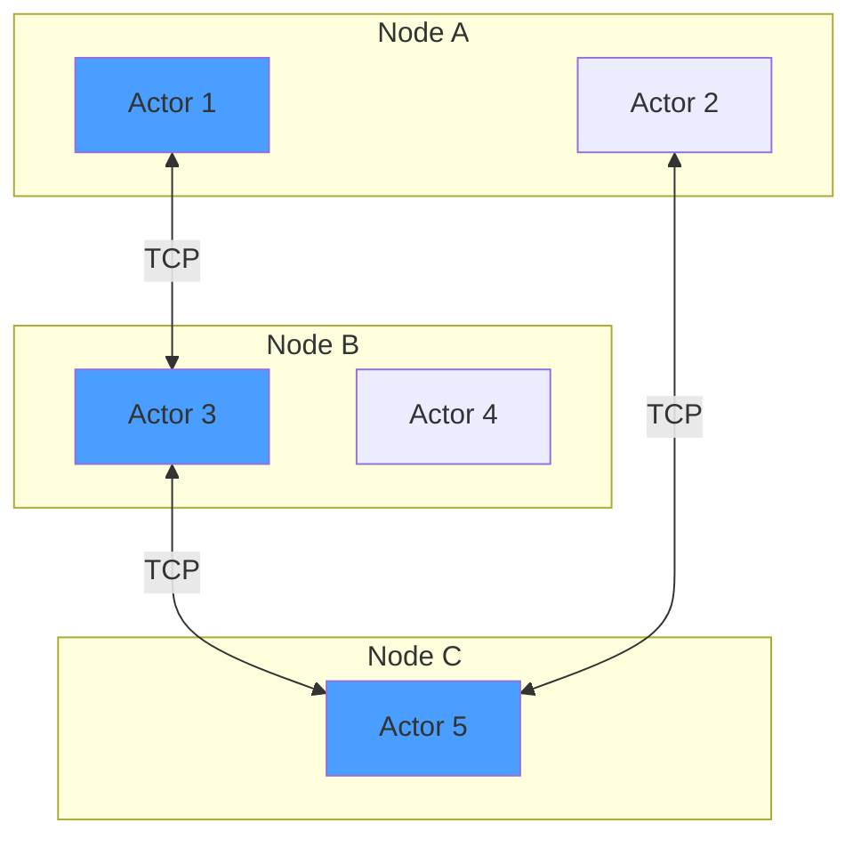

# Cinema

A lightweight actor model framework for Rust, inspired by Erlang/OTP, Akka, and actix.

## Features

- **Async/await native** - Built on Tokio
- **Typed messages** - Compile-time message safety
- **Supervision** - Restart, Stop, Escalate strategies (OTP-style)
- **Streams** - Process external data streams within actors
- **Timers** - `run_later` and `run_interval` scheduling
- **Registry** - Name-based actor lookup with auto-cleanup
- **Async handlers** - Non-blocking I/O in message handlers
- **Remote actors** - TCP transport with Protocol Buffers serialization

## Design Philosophy

Cinema prioritizes:
- **Explicit supervision** over silent recovery
- **Typed messaging** over dynamic routing
- **Sequential state ownership** over shared concurrency
- **Minimal magic**, maximal control

If you want HTTP-first or macro-heavy ergonomics, use [actix](https://actix.rs/).
If you want OTP-style fault tolerance in Rust, use Cinema.

> **Note on panics:** Cinema treats panics inside actors as failures, similar to Erlang process crashes. Panics are caught at actor boundaries and never crash the runtime.

## Context API

`Context<Self>` is the actor's handle to the runtime:

| Method | Description |
|--------|-------------|
| `spawn_child(actor)` | Spawn supervised child |
| `spawn_child_with_strategy(factory, strategy)` | Spawn with restart policy |
| `stop()` | Stop this actor |
| `address()` | Get own `Addr<Self>` |
| `run_later(duration, msg)` | Delayed self-message |
| `run_interval(duration, msg)` | Periodic self-message |
| `add_stream(stream)` | Attach async stream |
| `watch(addr)` | Get notified when actor dies |

## Architecture



## Supervision Tree



## Quick Start

```rust
use cinema::{Actor, Handler, Message, ActorSystem, Context};

// Define a message
struct Greet(String);

impl Message for Greet {
    type Result = String;
}

// Define an actor
struct Greeter;

impl Actor for Greeter {}

impl Handler<Greet> for Greeter {
    fn handle(&mut self, msg: Greet, _ctx: &mut Context<Self>) -> String {
        format!("Hello, {}!", msg.0)
    }
}

#[tokio::main]
async fn main() {
    let system = ActorSystem::new();
    let addr = system.spawn(Greeter);

    // Fire and forget
    addr.do_send(Greet("World".into()));

    // Request-response
    let response = addr.send(Greet("Cinema".into())).await.unwrap();
    println!("{}", response); // "Hello, Cinema!"
}
```

## Supervision

```rust
use cinema::{Actor, Context, SupervisorStrategy};
use std::time::Duration;

struct Parent;
struct Child;

impl Actor for Parent {
    fn started(&mut self, ctx: &mut Context<Self>) {
        // Restart child up to 3 times within 10 seconds
        ctx.spawn_child_with_strategy(
            || Child,
            SupervisorStrategy::restart(3, Duration::from_secs(10)),
        );
    }
}

impl Actor for Child {}
```

**Strategies:**
- `Stop` - Let actor die (default)
- `Restart { max_restarts, within }` - Restart on panic, up to N times within duration
- `Escalate` - Propagate failure to parent (OTP-style)

### Escalate (OTP-style failure propagation)



```rust
impl Actor for Grandparent {
    fn started(&mut self, ctx: &mut Context<Self>) {
        // Grandparent restarts Parent on failure
        ctx.spawn_child_with_strategy(
            || Parent,
            SupervisorStrategy::restart(3, Duration::from_secs(10)),
        );
    }
}

impl Actor for Parent {
    fn started(&mut self, ctx: &mut Context<Self>) {
        // Parent escalates Child failures to Grandparent
        ctx.spawn_child_with_strategy(
            || Child,
            SupervisorStrategy::Escalate,
        );
    }
}

impl Actor for Child {
    fn started(&mut self, _ctx: &mut Context<Self>) {
        panic!("Child crashes!"); // Parent escalates -> Grandparent restarts Parent
    }
}
```

## Streams

```rust
use cinema::{Actor, StreamHandler, Context};
use tokio_stream::wrappers::UnboundedReceiverStream;

struct MyActor {
    stream: Option<UnboundedReceiverStream<i32>>,
}

impl Actor for MyActor {
    fn started(&mut self, ctx: &mut Context<Self>) {
        if let Some(stream) = self.stream.take() {
            ctx.add_stream(stream);
        }
    }
}

impl StreamHandler<i32> for MyActor {
    fn handle(&mut self, item: i32, _ctx: &mut Context<Self>) {
        println!("Received: {}", item);
    }

    fn finished(&mut self, _ctx: &mut Context<Self>) {
        println!("Stream completed");
    }
}
```

## Registry

```rust
let system = ActorSystem::new();
let addr = system.spawn(MyActor);

// Register with auto-unregister on actor death
system.register("my_actor", addr);

// Lookup
if let Some(addr) = system.lookup::<MyActor>("my_actor") {
    addr.do_send(SomeMessage);
}
```

> **Failure semantics:** Registry entries are automatically removed when actors stop. During restarts, the same `Addr` remains valid - senders don't need to re-lookup.

## CRUD Example

A simple in-memory user store - **no locks needed!**

> The actor processes one message at a time, so state is naturally protected without `Mutex` or `RwLock`.

```rust
use cinema::{Actor, Handler, Message, ActorSystem, Context};
use std::collections::HashMap;

// ---- Messages ----

struct CreateUser { id: u64, name: String }
struct GetUser { id: u64 }
struct UpdateUser { id: u64, name: String }
struct DeleteUser { id: u64 }

impl Message for CreateUser { type Result = (); }
impl Message for GetUser { type Result = Option<String>; }
impl Message for UpdateUser { type Result = bool; }
impl Message for DeleteUser { type Result = bool; }

// ---- Actor ----

struct UserStore {
    users: HashMap<u64, String>,
}

impl Actor for UserStore {}

impl Handler<CreateUser> for UserStore {
    fn handle(&mut self, msg: CreateUser, _ctx: &mut Context<Self>) {
        self.users.insert(msg.id, msg.name);
    }
}

impl Handler<GetUser> for UserStore {
    fn handle(&mut self, msg: GetUser, _ctx: &mut Context<Self>) -> Option<String> {
        self.users.get(&msg.id).cloned()
    }
}

impl Handler<UpdateUser> for UserStore {
    fn handle(&mut self, msg: UpdateUser, _ctx: &mut Context<Self>) -> bool {
        if self.users.contains_key(&msg.id) {
            self.users.insert(msg.id, msg.name);
            true
        } else {
            false
        }
    }
}

impl Handler<DeleteUser> for UserStore {
    fn handle(&mut self, msg: DeleteUser, _ctx: &mut Context<Self>) -> bool {
        self.users.remove(&msg.id).is_some()
    }
}

// ---- Usage ----

#[tokio::main]
async fn main() {
    let system = ActorSystem::new();
    let store = system.spawn(UserStore { users: HashMap::new() });

    // Create
    store.do_send(CreateUser { id: 1, name: "Alice".into() });

    // Read
    let user = store.send(GetUser { id: 1 }).await.unwrap();
    println!("{:?}", user); // Some("Alice")

    // Update
    let updated = store.send(UpdateUser { id: 1, name: "Alicia".into() }).await.unwrap();
    println!("{}", updated); // true

    // Delete
    let deleted = store.send(DeleteUser { id: 1 }).await.unwrap();
    println!("{}", deleted); // true
}
```

## Examples

Run the TCP chat server example:

```bash
cargo run -p chat
```

Connect with netcat:

```bash
nc localhost 8080
```

## Remote Actors

Cinema supports sending messages to actors on other nodes over TCP with Protocol Buffers serialization.

### How It Works



### Define Remote Messages

Messages must implement `RemoteMessage` (protobuf serializable). The `type_id` is auto-derived from Rust's type name:

```rust
use cinema::{Message, remote::RemoteMessage};
use prost::Message as ProstMessage;

// Request message
#[derive(Clone, ProstMessage)]
struct Add {
    #[prost(int32, tag = "1")]
    n: i32,
}
impl Message for Add {
    type Result = AddResult;  // Result must also be RemoteMessage
}
impl RemoteMessage for Add {}  // type_id auto-derived!

// Response message
#[derive(Clone, ProstMessage)]
struct AddResult {
    #[prost(int32, tag = "1")]
    value: i32,
}
impl Message for AddResult {
    type Result = ();
}
impl RemoteMessage for AddResult {}  // type_id auto-derived!
```

### Server Side

```rust
use cinema::{Actor, Handler, ActorSystem, Context};
use cinema::remote::{LocalNode, RemoteServer, TcpTransport};

struct Calculator { value: i32 }

impl Actor for Calculator {}

impl Handler<Add> for Calculator {
    fn handle(&mut self, msg: Add, _ctx: &mut Context<Self>) -> AddResult {
        self.value += msg.n;
        AddResult { value: self.value }
    }
}

#[tokio::main]
async fn main() {
    let system = ActorSystem::new();
    let calc = system.spawn(Calculator { value: 0 });

    // Configure node identity
    let node = LocalNode::new("calc-server");

    // Create handler (1 line vs 20 lines of boilerplate)
    let handler = node.handler::<Calculator, Add>(calc);

    // Start server
    let server = RemoteServer::bind("0.0.0.0:8080", handler).await.unwrap();
    server.run().await;
}
```

### Client Side

```rust
use cinema::remote::{RemoteClient, TcpTransport, Transport};

#[tokio::main]
async fn main() {
    // Connect to server
    let transport = TcpTransport;
    let conn = transport.connect("127.0.0.1:8080").await.unwrap();
    let client = RemoteClient::new(conn);

    // Create remote address (identity auto-derived from socket)
    let remote = client.remote_addr::<Calculator>("calc-server", "calculator");

    // Send message (same API as local!)
    let response = remote.send(Add { n: 5 }).await.unwrap();

    // Decode response
    let result = AddResult::decode(response.payload.as_slice()).unwrap();
    println!("Result: {}", result.value);
}
```

> **Auto-derived identity:** `RemoteClient` captures the TCP socket's local address (e.g., `127.0.0.1:54321`) as its identity. Use `LocalNode` instead if you want meaningful names like `"order-service"`.

### Multiple Message Types

Use `MessageRouter` to handle different message types:

```rust
use cinema::remote::MessageRouter;

let handler = MessageRouter::new()
    .route::<Add>(node.handler::<Calculator, Add>(calc.clone()))
    .route::<Subtract>(node.handler::<Calculator, Subtract>(calc.clone()))
    .route::<GetValue>(node.handler::<Calculator, GetValue>(calc))
    .build();

let server = RemoteServer::bind("0.0.0.0:8080", handler).await.unwrap();
```

### Architecture



## Roadmap


### Cluster Discovery (Coming Soon)

- **Gossip Protocol** - Automatic node discovery
- **Failure Detection** - Heartbeat-based node health monitoring
- **Distributed Registry** - Lookup actors across the cluster

**Non-goals** (by design):
- Global ordering guarantees
- Exactly-once delivery
- Transparent shared state

Cinema follows Erlang's philosophy: let it crash, retry, and reconcile.



## License

MIT
