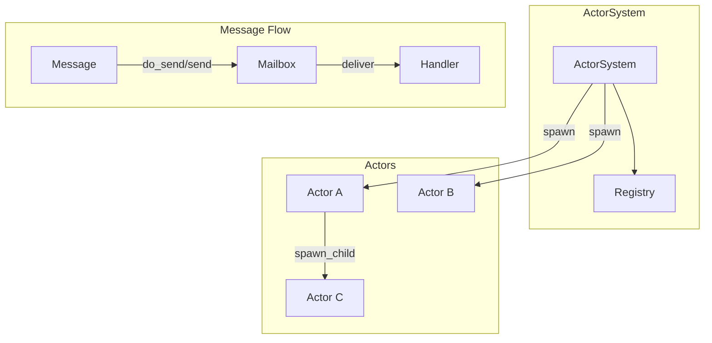
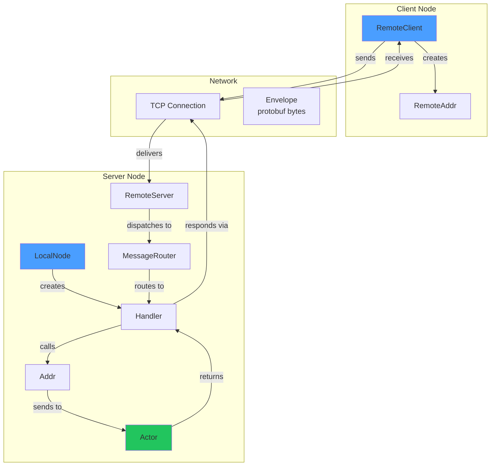
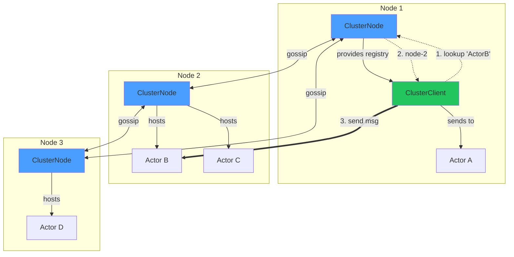
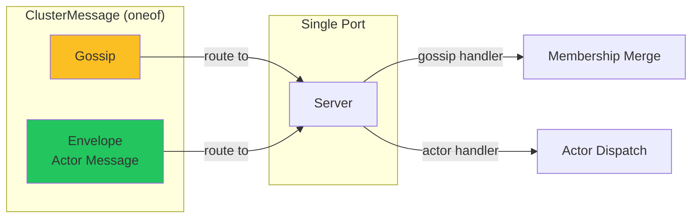

# Cinema

A lightweight actor model framework for Rust, inspired by Erlang/OTP, Akka, and actix.

## Features

- **Async/await native** - Built on Tokio
- **Typed messages** - Compile-time message safety
- **Bounded mailboxes** - Default capacity of 256 messages prevents OOM from slow consumers
- **Supervision** - Restart, Stop, Escalate strategies (OTP-style)
- **Streams** - Process external data streams within actors
- **Timers** - `run_later` and `run_interval` scheduling
- **Registry** - Name-based actor lookup with auto-cleanup
- **Async handlers** - Non-blocking I/O in message handlers
- **Remote actors** - TCP transport with Protocol Buffers serialization
- **Cluster** - Gossip protocol for membership, failure detection, and distributed actor registry

## Design Philosophy

Cinema prioritizes:
- **Explicit supervision** over silent recovery
- **Typed messaging** over dynamic routing
- **Sequential state ownership** over shared concurrency
- **Minimal magic**, maximal control

If you want HTTP-first or macro-heavy ergonomics, use [actix](https://actix.rs/).
If you want OTP-style fault tolerance in Rust, use Cinema.

> **Note on panics:** Cinema treats panics inside actors as failures, similar to Erlang process crashes. Panics are caught at actor boundaries and never crash the runtime.

---

## Table of Contents

1. [Quick Start](#quick-start)
2. [Mailbox Configuration](#mailbox-configuration)
3. [Core Concepts](#core-concepts)
   - [Context API](#context-api)
   - [Supervision](#supervision)
   - [Streams](#streams)
   - [Registry](#registry)
4. [Remote Actors](#remote-actors)
   - [Basic Remote Messaging](#basic-remote-messaging)
   - [Message Router](#message-router)
5. [Cluster](#cluster)
   - [Gossip Protocol](#gossip-protocol)
   - [Failure Detection](#failure-detection)
   - [Distributed Actor Registry](#distributed-actor-registry)
   - [Cluster-Aware Remote Communication](#cluster-aware-remote-communication)
6. [Examples](#examples)
7. [Performance](#performance)
8. [Architecture](#architecture)
9. [License](#license)

---

## Quick Start

```rust
use cinema::{Actor, Handler, Message, ActorSystem, Context};

// define a message
struct Greet(String);

impl Message for Greet {
    type Result = String;
}

// define an actor
struct Greeter;

impl Actor for Greeter {}

impl Handler<Greet> for Greeter {
    fn handle(&mut self, msg: Greet, _ctx: &mut Context<Self>) -> String {
        format!("Hello, {}!", msg.0)
    }
}

#[tokio::main]
async fn main() {
    let system = ActorSystem::new();
    let addr = system.spawn(Greeter);

    // fire and forget (async, applies backpressure if mailbox full)
    addr.do_send(Greet("World".into())).await.unwrap();

    // request-response
    let response = addr.send(Greet("Cinema".into())).await.unwrap();
    println!("{}", response); // "Hello, Cinema!"
}
```

---

## Mailbox Configuration

Cinema uses **bounded mailboxes** (default capacity: 256 messages) to prevent out-of-memory issues from slow consumers.

### Spawning with Custom Capacity

```rust
// default capacity (256)
let addr = system.spawn(MyActor);

// custom capacity for high-throughput actors
let addr = system.spawn_with_capacity(MyActor, 10000);

// child actors with custom capacity
ctx.spawn_child_with_capacity(ChildActor, 1000);
```

### Message Sending Patterns

```rust
// async send with backpressure (blocks if mailbox full)
addr.do_send(msg).await?;

// non-blocking try_send (returns MailboxFull error if full)
addr.try_send(msg)?;

// request-response (always async)
let response = addr.send(msg).await?;
```

> **When to use which:**
> - Use `do_send().await` in async contexts when you want backpressure
> - Use `try_send()` in sync contexts (handlers, lifecycle hooks) or when you want immediate failure
> - Benchmarks and high-throughput scenarios should use `try_send()` or increase mailbox capacity

---

## Core Concepts

### Context API

`Context<Self>` is the actor's handle to the runtime:

| Method | Description |
|--------|-------------|
| `spawn_child(actor)` | Spawn supervised child (default capacity: 256) |
| `spawn_child_with_capacity(actor, capacity)` | Spawn child with custom mailbox capacity |
| `spawn_child_with_strategy(factory, strategy)` | Spawn with restart policy |
| `spawn_child_with_strategy_and_capacity(...)` | Spawn with restart policy and custom capacity |
| `stop()` | Stop this actor |
| `address()` | Get own `Addr<Self>` |
| `run_later(duration, msg)` | Delayed self-message |
| `run_interval(duration, msg)` | Periodic self-message |
| `add_stream(stream)` | Attach async stream |
| `watch(addr)` | Get notified when actor dies |

### Supervision

```rust
use cinema::{Actor, Context, SupervisorStrategy};
use std::time::Duration;

struct Parent;
struct Child;

impl Actor for Parent {
    fn started(&mut self, ctx: &mut Context<Self>) {
        // restart child up to 3 times within 10 seconds
        ctx.spawn_child_with_strategy(
            || Child,
            SupervisorStrategy::restart(3, Duration::from_secs(10)),
        );
    }
}

impl Actor for Child {}
```

**Strategies:**
- `Stop` - Let actor die (default)
- `Restart { max_restarts, within }` - Restart on panic, up to N times within duration
- `Escalate` - Propagate failure to parent (OTP-style)

### Streams

```rust
use cinema::{Actor, StreamHandler, Context};
use tokio_stream::wrappers::UnboundedReceiverStream;

struct MyActor {
    stream: Option<UnboundedReceiverStream<i32>>,
}

impl Actor for MyActor {
    fn started(&mut self, ctx: &mut Context<Self>) {
        if let Some(stream) = self.stream.take() {
            ctx.add_stream(stream);
        }
    }
}

impl StreamHandler<i32> for MyActor {
    fn handle(&mut self, item: i32, _ctx: &mut Context<Self>) {
        println!("Received: {}", item);
    }

    fn finished(&mut self, _ctx: &mut Context<Self>) {
        println!("Stream completed");
    }
}
```

### Registry

```rust
let system = ActorSystem::new();
let addr = system.spawn(MyActor);

// register with auto-unregister on actor death
system.register("my_actor", addr);

// lookup
if let Some(addr) = system.lookup::<MyActor>("my_actor") {
    addr.do_send(SomeMessage).await.unwrap();
}
```

> **Failure semantics:** Registry entries are automatically removed when actors stop. During restarts, the same `Addr` remains valid - senders don't need to re-lookup.

---

## Remote Actors

Cinema supports sending messages to actors on other nodes over TCP with Protocol Buffers serialization.

### Basic Remote Messaging

**Define messages** (protobuf serializable):

```rust
use cinema::{Message, remote::RemoteMessage};
use prost::Message as ProstMessage;

// request message
#[derive(Clone, ProstMessage)]
struct Add {
    #[prost(int32, tag = "1")]
    n: i32,
}
impl Message for Add {
    type Result = AddResult;
}
impl RemoteMessage for Add {}

// response message
#[derive(Clone, ProstMessage)]
struct AddResult {
    #[prost(int32, tag = "1")]
    value: i32,
}
impl Message for AddResult {
    type Result = ();
}
impl RemoteMessage for AddResult {}
```

**Server side:**

```rust
use cinema::{Actor, Handler, ActorSystem, Context};
use cinema::remote::{LocalNode, RemoteServer};

struct Calculator { value: i32 }

impl Actor for Calculator {}

impl Handler<Add> for Calculator {
    fn handle(&mut self, msg: Add, _ctx: &mut Context<Self>) -> AddResult {
        self.value += msg.n;
        AddResult { value: self.value }
    }
}

#[tokio::main]
async fn main() {
    let system = ActorSystem::new();
    let calc = system.spawn(Calculator { value: 0 });

    let node = LocalNode::new("calc-server");
    let handler = node.handler::<Calculator, Add>(calc);

    let server = RemoteServer::bind("0.0.0.0:8080", handler).await.unwrap();
    server.run().await;
}
```

**Client side:**

```rust
use cinema::remote::{RemoteClient, TcpTransport, Transport};

#[tokio::main]
async fn main() {
    let transport = TcpTransport;
    let conn = transport.connect("127.0.0.1:8080").await.unwrap();
    let client = RemoteClient::new(conn);

    let remote = client.remote_addr::<Calculator>("calc-server", "calculator");

    let response = remote.send(Add { n: 5 }).await.unwrap();
    let result = AddResult::decode(response.payload.as_slice()).unwrap();
    println!("Result: {}", result.value);
}
```

### Message Router

Handle multiple message types:

```rust
use cinema::remote::MessageRouter;

let handler = MessageRouter::new()
    .route::<Add>(node.handler::<Calculator, Add>(calc.clone()))
    .route::<Subtract>(node.handler::<Calculator, Subtract>(calc.clone()))
    .route::<GetValue>(node.handler::<Calculator, GetValue>(calc))
    .build();

let server = RemoteServer::bind("0.0.0.0:8080", handler).await.unwrap();
```

---

## Cluster

Cinema provides a gossip-based cluster with:
- **Membership management** - Track which nodes are in the cluster
- **Failure detection** - Mark nodes as SUSPECT/DOWN based on heartbeat
- **Distributed actor registry** - Discover which node hosts an actor
- **Location-transparent messaging** - Send to actors by name, not node address

### Gossip Protocol

Nodes exchange membership information to achieve eventual consistency:

```rust
use cinema::remote::cluster::{ClusterNode, Node, NodeStatus};
use std::sync::Arc;
use std::time::Duration;

#[tokio::main]
async fn main() {
    // create cluster node
    let node1 = Arc::new(ClusterNode::new(
        "node-1".to_string(),
        "127.0.0.1:7001".to_string(),
    ));

    // start gossip server
    tokio::spawn(node1.clone().start_gossip_server(7001));

    // add peer and start periodic gossip
    node1.add_member(Node {
        id: "node-2".to_string(),
        addr: "127.0.0.1:7002".to_string(),
        status: NodeStatus::Up,
    }).await;

    // gossip every 100ms, mark suspect after 5s
    node1.clone().start_periodic_gossip(
        Duration::from_millis(100),
        Duration::from_secs(5),
    );

    // after multiple rounds, all nodes converge to same membership view
}
```

### Failure Detection

Nodes track heartbeat timestamps and mark unresponsive nodes:

- **Up** → **Suspect** after `suspect_timeout`
- **Suspect** → **Down** after `suspect_timeout * 2`

```rust
// node becomes SUSPECT if no gossip for 5s
// node becomes DOWN if no gossip for 10s
node.start_periodic_gossip(
    Duration::from_millis(100),
    Duration::from_secs(5),
);
```

### Distributed Actor Registry

Actors register on their local node, and their location spreads via gossip:

```rust
// node2 registers an actor
node2.register_actor("user-store".to_string(), "UserStore".to_string()).await;

// after gossip propagates, node1 can lookup the actor
let location = node1.lookup_actor("user-store").await;
// Some(("node-2", "UserStore"))
```

**Actor cleanup:** When a node goes DOWN, all its actors are removed from the registry.

### Cluster-Aware Remote Communication

`ClusterClient` combines cluster discovery with remote messaging:

**Server setup:**

```rust
use cinema::{Actor, Handler, ActorSystem, Context};
use cinema::remote::{LocalNode, MessageRouter};
use cinema::remote::cluster::ClusterNode;
use std::sync::Arc;

// actor
struct PingPong;
impl Actor for PingPong {}

#[derive(Clone, prost::Message)]
struct Ping { #[prost(string, tag = "1")] msg: String }
impl Message for Ping { type Result = Pong; }
impl RemoteMessage for Ping {}

#[derive(Clone, prost::Message)]
struct Pong { #[prost(string, tag = "1")] reply: String }
impl Message for Pong { type Result = (); }
impl RemoteMessage for Pong {}

impl Handler<Ping> for PingPong {
    fn handle(&mut self, msg: Ping, _ctx: &mut Context<Self>) -> Pong {
        Pong { reply: format!("pong: {}", msg.msg) }
    }
}

#[tokio::main]
async fn main() {
    let system = ActorSystem::new();
    let actor = system.spawn(PingPong);

    // create cluster node
    let node = Arc::new(ClusterNode::new(
        "node-2".to_string(),
        "127.0.0.1:9002".to_string(),
    ));

    // register actor in cluster
    node.register_actor("pingpong".to_string(), "PingPong".to_string()).await;

    // create handler
    let local_node = LocalNode::new("node-2");
    let handler = MessageRouter::new()
        .route::<Ping>(local_node.handler::<PingPong, Ping>(actor))
        .build();

    // start unified server (gossip + actor messages)
    tokio::spawn(node.clone().start_server(9002, Some(handler)));

    // start periodic gossip
    node.clone().start_periodic_gossip(
        Duration::from_millis(100),
        Duration::from_secs(10),
    );
}
```

**Client usage:**

```rust
use cinema::remote::{ClusterClient, ClusterRemoteAddr};

// create cluster client
let client = ClusterClient::new(node1.clone());

// create typed remote address (no manual node lookup needed!)
let remote: ClusterRemoteAddr<PingPong> = client.remote_addr("pingpong");

// option 1: low-level send (returns envelope)
let envelope = remote.send(Ping { msg: "hello" }).await?;
let pong = Pong::decode(envelope.payload.as_slice())?;

// option 2: high-level call (auto-decodes response) - recommended
let pong: Pong = remote.call(Ping { msg: "hello" }).await?;
println!("{}", pong.reply); // "pong: hello"

// option 3: fire-and-forget
remote.do_send(Ping { msg: "notify" }).await?;
```

**How it works:**

1. `remote.call(Ping { ... })` looks up "pingpong" in cluster registry → finds node-2
2. Gets/creates RemoteClient connection to node-2
3. Wraps message in ClusterMessage (multiplexed protocol)
4. Sends with correlation ID tracking for concurrent requests
5. Receives response and auto-decodes to typed `Pong`

**Features:**

- **Location transparency** - send by actor name, not node address
- **Automatic discovery** - cluster registry finds the actor's node
- **Connection pooling** - reuses connections per node
- **Concurrent requests** - multiple requests multiplexed over one connection
- **Type-safe API** - compile-time checked request/response types
- **Error recovery** - failed connections auto-removed and recreated

---

## Examples

### CRUD Example

A simple in-memory user store - **no locks needed!**

```rust
use cinema::{Actor, Handler, Message, ActorSystem, Context};
use std::collections::HashMap;

// messages
struct CreateUser { id: u64, name: String }
struct GetUser { id: u64 }
struct UpdateUser { id: u64, name: String }
struct DeleteUser { id: u64 }

impl Message for CreateUser { type Result = (); }
impl Message for GetUser { type Result = Option<String>; }
impl Message for UpdateUser { type Result = bool; }
impl Message for DeleteUser { type Result = bool; }

// actor
struct UserStore {
    users: HashMap<u64, String>,
}

impl Actor for UserStore {}

impl Handler<CreateUser> for UserStore {
    fn handle(&mut self, msg: CreateUser, _ctx: &mut Context<Self>) {
        self.users.insert(msg.id, msg.name);
    }
}

impl Handler<GetUser> for UserStore {
    fn handle(&mut self, msg: GetUser, _ctx: &mut Context<Self>) -> Option<String> {
        self.users.get(&msg.id).cloned()
    }
}

impl Handler<UpdateUser> for UserStore {
    fn handle(&mut self, msg: UpdateUser, _ctx: &mut Context<Self>) -> bool {
        if self.users.contains_key(&msg.id) {
            self.users.insert(msg.id, msg.name);
            true
        } else {
            false
        }
    }
}

impl Handler<DeleteUser> for UserStore {
    fn handle(&mut self, msg: DeleteUser, _ctx: &mut Context<Self>) -> bool {
        self.users.remove(&msg.id).is_some()
    }
}
```

### TCP Chat Server

Run the chat server example:

```bash
cargo run -p chat
```

Connect with netcat:

```bash
nc localhost 8080
```

See [examples/chat/README.md](examples/chat/README.md) for details.

### Distributed Key-Value Store

demonstrates cluster capabilities: gossip membership, actor discovery, location-transparent messaging, and failure detection.

```bash
# start first node
cargo run -p distributed-kv -- node-1

# start second node (joins via first)
cargo run -p distributed-kv -- node-2 127.0.0.1:7001

# start third node
cargo run -p distributed-kv -- node-3 127.0.0.1:7001
```

interactive cli commands:
```
> set user:1 alice
OK

> get user:1
alice

> members
cluster members:
  node-1 @ 127.0.0.1:7001 [Up]
  node-2 @ 127.0.0.1:7002 [Up]
  node-3 @ 127.0.0.1:7003 [Up]

> actors
registered actors:
  kv-store -> node-1 (KVStore)
```

See [examples/distributed-kv/README.md](examples/distributed-kv/README.md) for details.

---

## Performance

Cinema is designed for high throughput and low latency. All benchmarks run on a single machine using [Criterion](https://github.com/bheisler/criterion.rs).

### Actor Lifecycle

| Operation | Time | Throughput |
|-----------|------|------------|
| Spawn single actor | **2.2 µs** | 454k actors/sec |
| Spawn 10 actors | 22.9 µs | **2.3 µs/actor** |
| Spawn 100 actors | 228.8 µs | **2.3 µs/actor** |
| Spawn 1000 actors | 1.5 ms | **1.5 µs/actor** |

**Analysis:** Perfect linear scaling. Minor improvement at 1000 actors due to better CPU cache utilization. Each actor gets its own mailbox (bounded channel, default capacity 256) and spawns a tokio task.

### Message Passing

| Scenario | Time | Throughput |
|----------|------|------------|
| 100 msgs (single actor) | 11.2 ms | ~9k msgs/sec |
| 1k msgs (single actor) | 11.6 ms | ~86k msgs/sec |
| 10k msgs (single actor) | 12.9 ms | **~775k msgs/sec** |
| 100k msgs (100 actors × 1k each) | 66.5 ms | **~1.5M msgs/sec** |

**Analysis:** The 10ms sleep in the benchmark dominates. Actual message dispatch overhead is negligible - bounded channels provide excellent throughput with minimal overhead. Parallel throughput shows excellent scaling with multiple actors.

### Request-Response Latency

| Operation | Latency | Notes |
|-----------|---------|-------|
| Sync handler | **17.8 µs** | Includes oneshot channel overhead |
| Async handler | 1.28 ms | Includes 10µs simulated async work |
| Batched 10 requests | 25.4 µs | **2.5 µs/req** (7x faster) |
| Batched 100 requests | 63.2 µs | **0.6 µs/req** (28x faster!) |

**Analysis:**
- Single request-response: ~18µs round-trip (send → handler → response via oneshot)
- Pipelining via `join_all` shows **massive improvements** - 100 concurrent requests achieve 28× better per-request latency
- Cinema's async runtime handles concurrent requests efficiently

### Cluster Performance

#### Gossip Protocol

| Operation | Time | Scaling |
|-----------|------|---------|
| Create gossip (10 nodes) | 8.8 µs | - |
| Create gossip (50 nodes) | 40.6 µs | **0.81 µs/node** |
| Create gossip (100 nodes) | 76.0 µs | **0.76 µs/node** |
| Merge gossip (50 nodes) | **29.8 µs** | Fast even with RwLock writes |
| Convergence (7-node chain) | 112 ms | Includes TCP + serialization |

**Analysis:**
- Gossip creation scales linearly with member count
- Merge operation is fast - no RwLock contention bottleneck
- Full 7-node convergence in ~112ms includes all network overhead, handshakes, and sleep delays

#### Serialization (Protocol Buffers)

| Payload Size | Encode | Decode | Round-trip |
|--------------|--------|--------|------------|
| 64 B | **48 ns** | **59 ns** | **113 ns** |
| 1 KB | 87 ns | 91 ns | 191 ns |
| 16 KB | 5.0 µs | 9.5 µs | 9.6 µs |
| 256 KB | 5.9 µs | 145 µs | 87 µs |

**Analysis:**
- Small payloads (64B-1KB): Ultra-fast at <200ns total
- Medium payloads (16KB): ~10µs round-trip
- Large payloads (256KB): Decode dominates (145µs), likely due to memory allocation

#### Failure Detection

| Operation | Time | Scaling |
|-----------|------|---------|
| Detect suspect (3 nodes) | **309 ms** | Within suspect_timeout + gossip_interval |
| Heartbeat check (10 nodes) | 4.8 µs | - |
| Heartbeat check (50 nodes) | 22.6 µs | **0.45 µs/node** |
| Heartbeat check (100 nodes) | 45.3 µs | **0.45 µs/node** |

**Analysis:**
- Suspect detection: ~309ms (with 100ms suspect_timeout + gossip delays)
- Heartbeat overhead scales linearly - just HashMap lookups
- <50µs to check 100 nodes - minimal CPU overhead for monitoring

### Running Benchmarks

```bash
# run all benchmarks (~10 min)
make bench

# run specific benchmark
make bench-actor      # actor spawn
make bench-msg        # message throughput
make bench-rr         # request-response
make bench-gossip     # cluster gossip
make bench-serial     # serialization
make bench-fail       # failure detection

# quick smoke test
make bench-quick

# view HTML reports
open target/criterion/report/index.html
```

### Key Takeaways

- **Sub-microsecond message dispatch** - actual send overhead is negligible
- **Linear actor spawn scaling** - predictable performance up to 1000s of actors
- **Excellent pipelining** - concurrent requests 28× faster than sequential
- **Ultra-fast serialization** - <200ns for small payloads, <10µs for 16KB
- **Fast gossip convergence** - 112ms for 7 nodes end-to-end
- **Efficient failure detection** - 309ms to detect failures, <50µs to check 100 nodes
- **No lock contention** - RwLocks in cluster don't bottleneck operations

---

## Architecture

### Local Actor System



### Remote Messaging



### Cluster Architecture



**Multiplexed Protocol:**



---

## Roadmap

- [x] Core Actors
- [x] Supervision
- [x] Streams
- [x] Registry
- [x] Remote Actors
- [x] Cluster Gossip
- [x] Failure Detection
- [x] Distributed Actor Registry
- [x] Cluster-Aware Messaging

**Coming Soon:**
- [ ] Cluster sharding
- [ ] Persistent actors (event sourcing)
- [ ] Distributed sagas

---

## License

MIT
